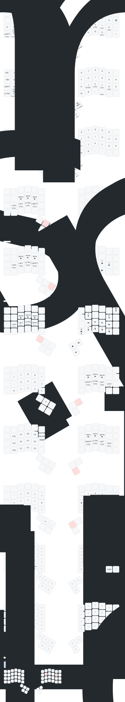

Miryoku inspired config for a charybdis 4x6 with a trackball.

## Positions

Positions and physical layout were generated via https://zmk-physical-layout-converter.streamlit.app (https://github.com/caksoylar/zmk-physical-layout-converter)

## Keymap

Keymaps are generated by [Keymap drawer](https://github.com/caksoylar/keymap-drawer).

